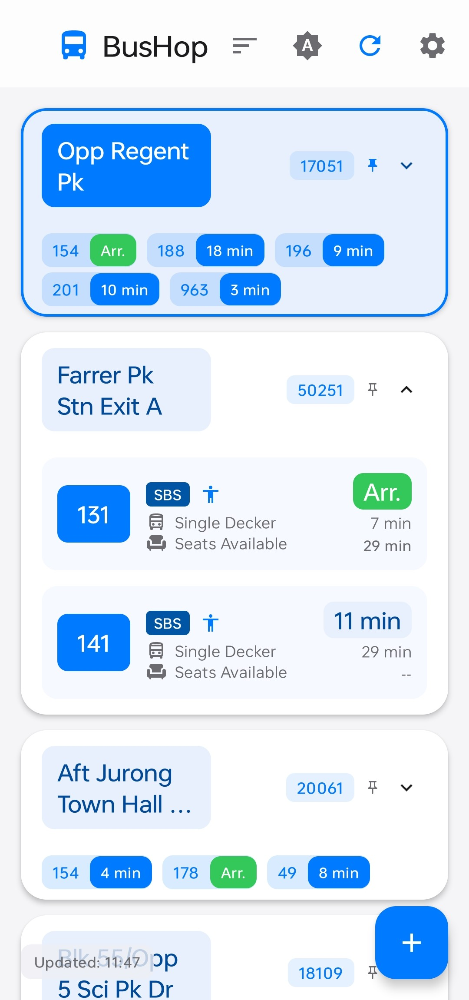
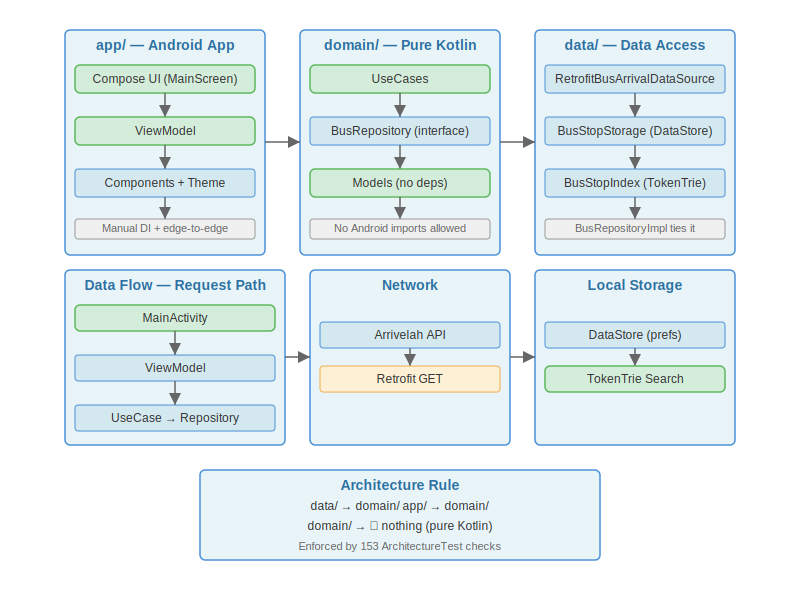
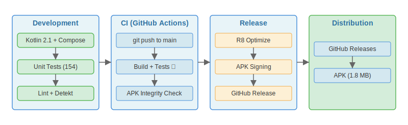

<div align="center">
  
  <h1>BusHop</h1>
  <p><strong>Lightweight Singapore bus timing app</strong></p>
  <p>Material 3 Compose UI with real-time arrivals, drag-to-reorder, pinning, and smart search. No ads, no accounts, no tracking.</p>
  <p>
    
    
    
    
    
    
  </p>
</div>

<p align="center">
  <sub>Built with AI assistance — see <a href="./CREDITS.md">CREDITS.md</a></sub>
  <br>
  <a href="./CREDITS.md"></a>
  <a href="./CREDITS.md"></a>
</p>

---

## Screenshots

| Stops list                                          | Search dialog                                            |
| --------------------------------------------------- | -------------------------------------------------------- |
| _Pinned stops at top, arrivals, pull-to-refresh_    | _TokenTrie O(k) search — instant, no network_            |
|  |  |

## Features

|     | Feature                  | Detail                                                                                                        |
| --- | ------------------------ | ------------------------------------------------------------------------------------------------------------- |
| 🚌  | **Real-time arrivals**   | Shows next 3 buses per service with minutes-to-arrival                                                        |
| 🏷️  | **Operator badges**      | SBS, SMRT, TTS, Go-Ahead colour-coded                                                                         |
| 🚍  | **Bus type icons**       | Single Decker, Double Decker, Bendy                                                                           |
| 💺  | **Load indicator**       | Seats Available / Standing Available / Limited Standing                                                       |
| ♿  | **Wheelchair info**      | Wheelchair Accessible Bus (WAB) indicator                                                                     |
| 📌  | **Pin stops & services** | Pin stops to the top; pin individual bus services within a stop. Survives restarts.                           |
| 🔍  | **Smart search**         | TokenTrie O(k) prefix search + Levenshtein fuzzy matching over 5,201 stops — instant, no network              |
| ✨  | **New stop pulse**       | List auto-scrolls to newly added stop with a brief blue pulse highlight                                       |
| 📍  | **Nearby stops**         | Location-based nearby stop finder (opt-in)                                                                    |
| 💡  | **Random hints**         | Random bus stop hint shown every time you open the search dialog (from all 5,201 stops)                       |
| 🌙  | **Theme support**        | Light, Dark, System-following, with Blue and Contrast Blue colour schemes — all persisted                     |
| 🔄  | **Auto-refresh**         | Configurable interval (30s / 1m / 2m / 5m / Off) — pauses in background                                       |
| ↘️  | **Pull to refresh**      | Swipe down to refresh all stops                                                                               |
| 🩺  | **API Health Banner**    | When the API has repeated failures, shows "Delayed" / "Under maintenance" banner — auto-dismisses on recovery |
| 📡  | **Offline indicator**    | Cloud-off icon per stop when no internet, "No internet connection" label, separate from error state           |
| 🖱️  | **Drag to reorder**      | Long-press and drag bus stops to reorder — commit on drag end                                                 |
| 🗑️  | **Drag to delete**       | Drag a stop into the bottom delete zone — card-center-in-zone threshold                                       |
| 🔢  | **Sort by earliest**     | Toggle stop card order by earliest arrival time — persists across restarts                                    |
| 🔒  | **Privacy first**        | Location is opt-in only. No accounts, no analytics, no telemetry                                              |
| 📱  | **Material 3**           | Modern Compose UI with animations, pull-to-refresh, edge-to-edge                                              |
| 🎨  | **Splash screen**        | Branded cold-start splash using core-splashscreen library                                                     |
| 📦  | **In-app update**        | Checks GitHub Releases for new version, downloads and installs APK directly                                   |

## Download

> **Latest release:** [v1.0.1](https://github.com/b67687-stable/Bus-Hop/releases/latest) — `app-release.apk` (**1.7 MB**, R8-minified, shrinkResources, signed)

Or [build from source](#build-from-source) for a debug APK.

## Architecture



- **domain/** — Pure Kotlin (zero framework deps). Models, use cases, repository interfaces.
- **data/** — Android library. Retrofit API calls, DataStore persistence, BusStopIndex with TokenTrie for search, update checker.
- **app/** — Android app. Jetpack Compose UI, ViewModels (MainViewModel + ThemeManager + UpdateManager), theme, components.

## Development Pipeline



1. **Development** — AI-driven implementation steered by human architectural direction. Unit tests (domain, data, app layers + architecture constraints) run during this phase via `./gradlew test`. Run `./gradlew updateBadges -PautoDetect` after changing test count.
2. **Build** — Release build with R8 minification + `shrinkResources` reduces the APK to ~1.7 MB (vs debug).
3. **Release** — APK signed and published as a GitHub Release (`gh release create`).
4. **Ship** — Tagged release (`v1.0.1`) distributed via Obtainium.

## Feature Flags

In-progress features ship behind toggles (dark by default). Enable them at runtime via the debug menu — long-press the version label in Settings → Feature Flags.

| Flag               | Default | Description                        |
| ------------------ | ------- | ---------------------------------- |
| `NEW_BUS_TIMELINE` | Off     | Redesigned bus arrival timeline    |
| `NEARBY_STOPS_V2`  | Off     | Enhanced nearby stops with filters |
| `PINNED_REORDER`   | Off     | Pinned-stop reorder gestures       |

Flags are backed by `SharedPreferences` and can be toggled without a rebuild. Reset clears all overrides back to defaults. Add new flags to `FeatureFlag.kt` — the debug dialog picks them up automatically via `FeatureFlag.entries`.

## Tech Stack

| Layer         | Technology                                                |
| ------------- | --------------------------------------------------------- |
| Language      | Kotlin 2.4.0                                              |
| UI            | Jetpack Compose (BOM 2026.05.01) + Material 3             |
| Icons         | Material Icons Extended                                   |
| Architecture  | MVVM + Clean Architecture (3 modules)                     |
| Networking    | Retrofit 3 + OkHttp 5                                     |
| Serialization | Gson (data layer only)                                    |
| Persistence   | DataStore Preferences                                     |
| Async         | Kotlin Coroutines 1.11 + Flow                             |
| DI            | Manual constructor injection through ViewModel Factory    |
| Search        | Inverted index + TokenTrie (prefix) + Levenshtein (fuzzy) |
| Testing       | JUnit 4, MockK, Coroutines Test                           |
| Minification  | R8 + ProGuard (release builds)                            |
| Gradle        | 9.5.1, AGP 9.2.1                                          |
| Target        | SDK 37, minSdk 26                                         |

## Build from Source

### Prerequisites

- **JDK 17** (OpenJDK)
- **Android SDK 37** with build tools
- Set `ANDROID_HOME` to your SDK path

### Commands

```bash
# Debug build + tests + APK verification
./gradlew clean test checkAndRenameDebugApk

# Release build
./gradlew assembleRelease

# APK output at:
# app/build/outputs/apk/debug/bus-hop.apk
```

## Automated Checks

| Check              | When                            | Where                                                              |
| ------------------ | ------------------------------- | ------------------------------------------------------------------ |
| APK integrity      | Every `./gradlew assembleDebug` | `app/build.gradle.kts` — `checkAndRenameDebugApk`                  |
| Architecture tests | Every `./gradlew test`          | `ArchitectureTest.kt` — 8 rules (layer separation, ProGuard, deps) |
| Badge freshness    | After test count changes        | `./gradlew updateBadges -PtestCount=N` — refresh static SVGs       |

## Testing

**Unit tests** across 9 test classes — see [tests badge](docs/badges/tests.svg) for current count:

| Module                        | Tests | What's covered                                                              |
| ----------------------------- | ----- | --------------------------------------------------------------------------- |
| Domain: BusStopUseCase        | 28    | sortServices, sortServicesWithPins, applyPinning, toggleCollapsed           |
| Domain: Model                 | 8     | toDisplayArrival eta/load/busType mapping                                   |
| Domain: RefreshCoordinator    | 6     | Cooldown, independent cooldowns, concurrent batching                        |
| Domain: AutoRefreshController | 7     | Start/stop/restart lifecycle                                                |
| Data: BusStopIndex            | 45    | TokenTrie search (exact, prefix, fuzzy, abbreviations, sorting, findNearby) |
| Data: RetryUtil               | 6     | Retry with backoff, CancellationException propagation                       |
| Data: UpdateCheckerImpl       | 6     | GitHub API parsing, version comparison, error handling, download guard      |
| App: MainViewModel            | 47    | add/remove/move/pin/collapse/refresh/sort/errors                            |
| App: Architecture             | 8     | Layer separation, module deps, domain purity, catalog freshness, ProGuard   |

## API

BusHop uses the [Arrivelah](https://github.com/cheeaun/arrivelah) API (`arrivelah2.busrouter.sg`), which proxies LTA DataMall's BusArrivalv2 endpoint. No API key required.

## Privacy

| Data          | Collected?                                                     |
| ------------- | -------------------------------------------------------------- |
| Location      | 🔘 — opt-in (fine + coarse), never sent off-device             |
| Personal info | ❌ — no accounts, no sign-in                                   |
| Analytics     | ❌ — no tracking SDKs                                          |
| Crash reports | ❌ — not collected                                             |
| APK install   | 🔘 — used only when you tap "Download & Install" for an update |
| Saved stops   | 🔒 — stored locally in DataStore                               |
| API calls     | 🔒 — direct to BusRouter, no intermediary                      |

## License

MIT License — see [LICENSE](LICENSE).
